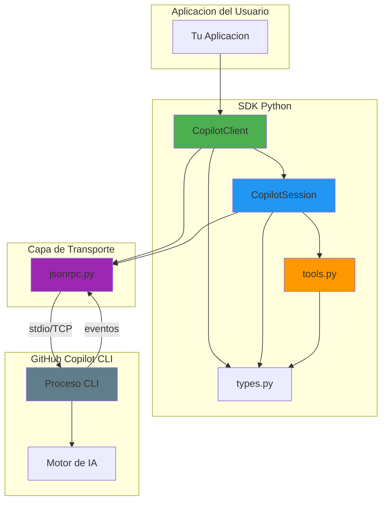
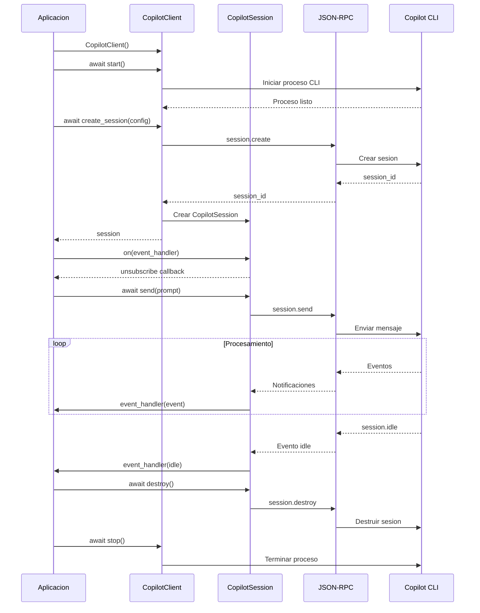

# GitHub Copilot SDK para Python

SDK oficial de Python para interactuar con el CLI de GitHub Copilot, permitiendo integrar capacidades de IA conversacional y herramientas de desarrollo en aplicaciones Python.

## 📋 Descripción General

Este SDK proporciona una interfaz Python completa y moderna para comunicarse con GitHub Copilot CLI. Permite crear sesiones conversacionales, gestionar herramientas personalizadas, controlar permisos y recibir eventos en tiempo real de las interacciones con el asistente.

**Características principales:**
- 🔄 Comunicación asíncrona con el CLI de Copilot
- 🛠️ Soporte para herramientas personalizadas con decoradores
- 🔐 Control granular de permisos
- 📡 Sistema de eventos en tiempo real
- 🎯 API simple e intuitiva basada en async/await
- 🔌 Soporte para múltiples modelos (GPT-4, GPT-5, Claude, etc.)

---

## 🏗️ Arquitectura del Sistema

### Diagrama de Arquitectura



### Componentes Principales

| Componente | Responsabilidad |
|------------|----------------|
| **CopilotClient** | Gestión del ciclo de vida del CLI, conexión y creación de sesiones |
| **CopilotSession** | Manejo de conversaciones individuales, eventos y herramientas |
| **tools.py** | Decoradores y utilidades para definir herramientas personalizadas |
| **types.py** | Definiciones de tipos TypedDict y Pydantic para toda la API |
| **jsonrpc.py** | Cliente JSON-RPC 2.0 para comunicación con el CLI |

---

## 🔄 Diagrama de Secuencia

Flujo típico de una interacción con el SDK:



---

## 📚 Módulos Principales

### 1. CopilotClient

Cliente principal para gestionar la conexión con el CLI de Copilot.

**Funcionalidades:**
- Iniciar y detener el proceso CLI
- Crear y resumir sesiones
- Gestionar el ciclo de vida de la conexión
- Soportar múltiples modos de transporte (stdio, TCP)

**Métodos principales:**
```python
async def start() -> None
    # Inicia el CLI y establece la conexión

async def stop() -> List[Dict[str, str]]
    # Detiene el CLI y limpia recursos

async def create_session(config: SessionConfig = None) -> CopilotSession
    # Crea una nueva sesión conversacional

async def resume_session(session_id: str, config: ResumeSessionConfig = None) -> CopilotSession
    # Retoma una sesión existente
```

**Opciones de configuración:**
```python
CopilotClientOptions = {
    "cli_path": str,        # Ruta al ejecutable del CLI (default: "copilot")
    "cwd": str,             # Directorio de trabajo (default: cwd actual)
    "use_stdio": bool,      # Usar stdio en lugar de TCP (default: True)
    "cli_url": str,         # Conectar a servidor CLI existente
    "log_level": str,       # Nivel de logs: "none" | "error" | "info" | "debug"
    "auto_start": bool,     # Auto-iniciar el CLI (default: True)
    "auto_restart": bool,   # Auto-reiniciar en caso de fallo (default: True)
    "env": Dict[str, str],  # Variables de entorno
}
```

---

### 2. CopilotSession

Representa una sesión de conversación individual con el asistente.

**Funcionalidades:**
- Enviar mensajes al asistente
- Recibir eventos en tiempo real
- Ejecutar herramientas personalizadas
- Gestionar permisos
- Obtener historial de mensajes

**Métodos principales:**
```python
async def send(options: MessageOptions) -> str
    # Envía un mensaje y retorna el message_id

async def send_and_wait(options: MessageOptions, timeout: float = 60) -> SessionEvent
    # Envía un mensaje y espera hasta que la sesión esté idle

def on(handler: Callable[[SessionEvent], None]) -> Callable[[], None]
    # Suscribe un manejador de eventos, retorna función para cancelar suscripción

async def get_messages() -> List[SessionEvent]
    # Obtiene el historial completo de la sesión

async def destroy() -> None
    # Destruye la sesión y libera recursos

async def abort() -> None
    # Aborta el mensaje en procesamiento
```

**Tipos de eventos:**
- `assistant.message` - Mensaje completo del asistente
- `assistant.message_delta` - Delta de streaming del mensaje
- `tool.execution_start` - Inicio de ejecución de herramienta
- `tool.execution_complete` - Fin de ejecución de herramienta
- `session.idle` - Sesión inactiva (procesamiento completado)
- `session.error` - Error en la sesión

---

### 3. Herramientas Personalizadas (@define_tool)

Define herramientas que el asistente puede invocar usando el decorador `@define_tool`.

**Características:**
- Generación automática de esquemas JSON a partir de modelos Pydantic
- Soporte para funciones síncronas y asíncronas
- Validación automática de parámetros
- Manejo de errores integrado

**Ejemplo básico:**
```python
from pydantic import BaseModel, Field
from copilot import define_tool

class CalculatorParams(BaseModel):
    operation: str = Field(description="Operación: add, subtract, multiply, divide")
    a: float = Field(description="Primer número")
    b: float = Field(description="Segundo número")

@define_tool(description="Realiza operaciones matemáticas")
def calculator(params: CalculatorParams) -> str:
    ops = {
        "add": params.a + params.b,
        "subtract": params.a - params.b,
        "multiply": params.a * params.b,
        "divide": params.a / params.b if params.b != 0 else "Error: división por cero"
    }
    result = ops.get(params.operation, "Operación no válida")
    return f"Resultado: {result}"

# Usar en una sesión
session = await client.create_session({
    "tools": [calculator],
    "model": "gpt-5"
})
```

**Firmas soportadas:**
```python
# Sin parámetros
@define_tool()
def tool_simple() -> str:
    return "resultado"

# Con parámetros Pydantic
@define_tool()
def tool_params(params: MiModelo) -> str:
    return f"procesado: {params.field}"

# Con invocation context
@define_tool()
def tool_context(params: MiModelo, invocation: ToolInvocation) -> str:
    session_id = invocation["session_id"]
    return f"sesión {session_id}"

# Asíncrona
@define_tool()
async def tool_async(params: MiModelo) -> str:
    await asyncio.sleep(1)
    return "resultado async"
```

---

### 4. Tipos y Configuraciones

El módulo `types.py` proporciona todas las definiciones de tipos TypedDict para la API.

**Configuraciones principales:**

**SessionConfig** - Configuración de sesión:
```python
{
    "model": "gpt-5" | "claude-sonnet-4" | ...,
    "tools": List[Tool],
    "system_message": SystemMessageConfig,
    "available_tools": List[str],
    "excluded_tools": List[str],
    "on_permission_request": PermissionHandler,
    "streaming": bool,
    "mcp_servers": Dict[str, MCPServerConfig],
    "custom_agents": List[CustomAgentConfig]
}
```

**MessageOptions** - Opciones de mensaje:
```python
{
    "prompt": str,
    "attachments": List[Attachment],  # Opcional
    "mode": "enqueue" | "immediate"   # Opcional
}
```

**SystemMessageConfig** - Configuración del mensaje de sistema:
```python
# Modo append (default) - Agrega contenido al sistema base
{
    "mode": "append",
    "content": "Contexto adicional..."
}

# Modo replace - Reemplaza completamente el sistema base
{
    "mode": "replace",
    "content": "Sistema completamente personalizado"
}
```

---

## 💡 Ejemplos de Uso

### Ejemplo 1: Pregunta Simple

```python
import asyncio
from copilot import CopilotClient

async def main():
    # Crear y iniciar cliente
    client = CopilotClient()
    await client.start()

    # Crear sesión
    session = await client.create_session({"model": "gpt-5"})

    # Esperar respuesta usando send_and_wait
    response = await session.send_and_wait({
        "prompt": "¿Cuánto es 2+2?"
    })

    if response:
        print(f"Respuesta: {response.data.content}")

    # Limpiar
    await session.destroy()
    await client.stop()

asyncio.run(main())
```

### Ejemplo 2: Manejo de Eventos

```python
import asyncio
from copilot import CopilotClient

async def main():
    client = CopilotClient({
        "log_level": "info"
    })
    await client.start()

    session = await client.create_session({"model": "gpt-5"})

    done = asyncio.Event()

    def on_event(event):
        event_type = event.type.value
        
        if event_type == "assistant.message":
            print(f"Asistente: {event.data.content}")
        elif event_type == "assistant.message_delta":
            # Streaming de respuesta en tiempo real
            print(event.data.delta_content, end="", flush=True)
        elif event_type == "session.idle":
            done.set()
        elif event_type == "session.error":
            print(f"Error: {event.data.message}")
            done.set()

    # Suscribirse a eventos
    unsubscribe = session.on(on_event)

    try:
        await session.send({"prompt": "Explícame qué es Python"})
        await asyncio.wait_for(done.wait(), timeout=30)
    finally:
        unsubscribe()
        await session.destroy()
        await client.stop()

asyncio.run(main())
```

### Ejemplo 3: Modo Agente con Permisos

```python
import asyncio
from copilot import CopilotClient

async def main():
    client = CopilotClient()
    await client.start()

    # Sesión con permisos automáticos (modo agente)
    session = await client.create_session({
        "model": "gpt-5",
        # Aprobar automáticamente todas las solicitudes de permisos
        "on_permission_request": lambda req, ctx: {"kind": "approved"}
    })

    done = asyncio.Event()

    def on_event(event):
        event_type = event.type.value

        if event_type == "assistant.message":
            print(f"\n[Asistente]: {event.data.content}")
        elif event_type == "tool.execution_start":
            print(f"\n[Ejecutando]: {event.data.tool_name}")
        elif event_type == "tool.execution_complete":
            print(f"[Completado]: {event.data.tool_name}")
        elif event_type in {"session.idle", "session.error"}:
            done.set()

    session.on(on_event)

    prompt = """
    Crea una función en Python que calcule los 10 primeros números de Fibonacci.
    Ejecuta la función y muestra el resultado.
    """

    try:
        await session.send({"prompt": prompt})
        await asyncio.wait_for(done.wait(), timeout=120)
    finally:
        await session.destroy()
        await client.stop()

asyncio.run(main())
```

### Ejemplo 4: Herramientas Personalizadas

```python
import asyncio
from pydantic import BaseModel, Field
from copilot import CopilotClient, define_tool

# Definir modelo de parámetros
class BuscarRepositorioParams(BaseModel):
    nombre: str = Field(description="Nombre del repositorio a buscar")

# Definir herramienta
@define_tool(description="Busca información de un repositorio en GitHub")
async def buscar_repositorio(params: BuscarRepositorioParams) -> str:
    # Simular búsqueda
    await asyncio.sleep(0.5)
    return f"Repositorio '{params.nombre}' encontrado: 1,234 estrellas, 56 forks"

async def main():
    client = CopilotClient()
    await client.start()

    # Crear sesión con herramienta personalizada
    session = await client.create_session({
        "model": "gpt-5",
        "tools": [buscar_repositorio]
    })

    response = await session.send_and_wait({
        "prompt": "Busca información sobre el repositorio 'copilot'"
    })

    if response:
        print(response.data.content)

    await session.destroy()
    await client.stop()

asyncio.run(main())
```

### Ejemplo 5: Adjuntar Archivos

```python
import asyncio
from copilot import CopilotClient

async def main():
    client = CopilotClient()
    await client.start()

    session = await client.create_session({"model": "gpt-5"})

    response = await session.send_and_wait({
        "prompt": "Analiza este código y sugiere mejoras",
        "attachments": [
            {
                "type": "file",
                "path": "./src/main.py",
                "displayName": "main.py"
            },
            {
                "type": "directory",
                "path": "./tests",
                "displayName": "Carpeta de tests"
            }
        ]
    })

    if response:
        print(response.data.content)

    await session.destroy()
    await client.stop()

asyncio.run(main())
```

---

## 📦 Requisitos e Instalación

### Requisitos Previos

- **Python**: ≥ 3.8
- **GitHub Copilot CLI**: Instalado y configurado
  ```bash
  # Instalar GitHub CLI con extensión Copilot
  gh extension install github/gh-copilot
  
  # O usar el CLI standalone
  # Descargar de: https://github.com/github/copilot-cli
  ```

### Instalación del SDK

#### Desde el código fuente:

```bash
# Clonar el repositorio
git clone https://github.com/github/copilot-sdk.git
cd copilot-sdk

# Instalar dependencias
pip install -e .

# O con dependencias de desarrollo
pip install -e ".[dev]"
```

#### Dependencias principales:

```
pydantic >= 2.0
python-dateutil >= 2.9.0
typing-extensions >= 4.0.0
```

### Verificar Instalación

```python
import asyncio
from copilot import CopilotClient

async def test():
    client = CopilotClient()
    await client.start()
    print("✓ SDK instalado correctamente")
    await client.stop()

asyncio.run(test())
```

---

## 🔧 Configuración Avanzada

### Conectar a un Servidor CLI Existente

```python
client = CopilotClient({
    "cli_url": "localhost:8080"  # O "8080" o "http://127.0.0.1:8080"
})
```

### Usar TCP en lugar de stdio

```python
client = CopilotClient({
    "use_stdio": False,
    "port": 3000  # Puerto específico (0 = automático)
})
```

### Variables de Entorno Personalizadas

```python
client = CopilotClient({
    "env": {
        "COPILOT_API_KEY": "tu-api-key",
        "CUSTOM_VAR": "valor"
    }
})
```

### Configurar Proveedor Personalizado (BYOK)

```python
session = await client.create_session({
    "model": "gpt-5",
    "provider": {
        "type": "openai",
        "base_url": "https://api.openai.com/v1",
        "api_key": "sk-...",
        "wire_api": "completions"
    }
})
```

### Servidores MCP (Model Context Protocol)

```python
session = await client.create_session({
    "model": "gpt-5",
    "mcp_servers": {
        "mi-servidor": {
            "type": "local",
            "command": "node",
            "args": ["./mi-servidor-mcp.js"],
            "tools": ["*"]  # "*" = todas, [] = ninguna, ["tool1", "tool2"] = específicas
        }
    }
})
```

---

## 🧪 Desarrollo y Testing

### Ejecutar Tests

```bash
# Instalar dependencias de desarrollo
pip install -e ".[dev]"

# Ejecutar tests
pytest

# Con cobertura
pytest --cov=copilot
```

### Linting

```bash
# Ejecutar linter
ruff check .

# Auto-formatear
ruff format .
```

### Estructura del Proyecto

```
copilot/
├── __init__.py           # Exportaciones públicas
├── client.py             # CopilotClient
├── session.py            # CopilotSession
├── tools.py              # @define_tool y utilidades
├── types.py              # Definiciones de tipos
├── jsonrpc.py            # Cliente JSON-RPC
├── sdk_protocol_version.py
└── generated/            # Tipos generados
    └── session_events.py
```

---

## 📄 Licencia

MIT License - Ver archivo `LICENSE` para más detalles.

---

## 🤝 Contribuciones

Las contribuciones son bienvenidas. Por favor:

1. Haz fork del repositorio
2. Crea una rama para tu feature (`git checkout -b feature/nueva-funcionalidad`)
3. Commit tus cambios (`git commit -am 'Añadir nueva funcionalidad'`)
4. Push a la rama (`git push origin feature/nueva-funcionalidad`)
5. Abre un Pull Request

---

## 📚 Recursos Adicionales

- [Documentación oficial de GitHub Copilot](https://docs.github.com/copilot)
- [GitHub Copilot CLI](https://github.com/github/copilot-cli)
- [Ejemplos adicionales](./examples/)

---

## 🐛 Reporte de Problemas

¿Encontraste un bug? [Abre un issue](https://github.com/github/copilot-sdk/issues)

---

**Desarrollado con ❤️ por GitHub**
