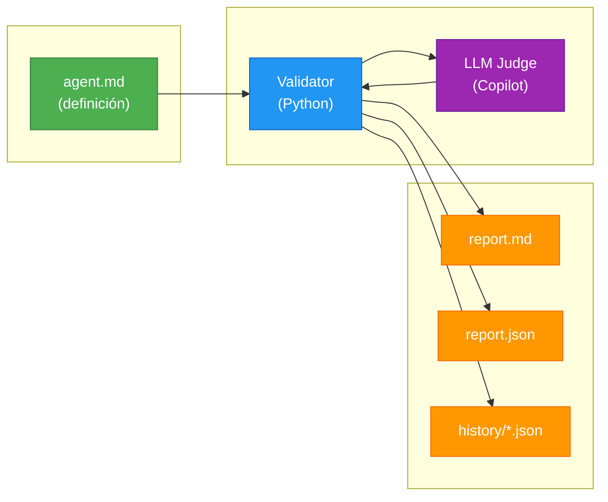
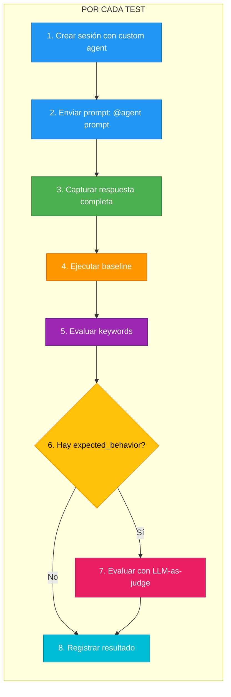
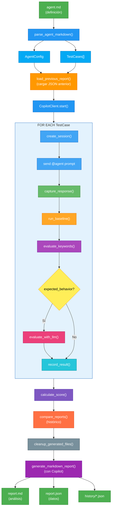

# Guía del Validador de Agentes

Esta guía explica paso a paso cómo funciona el **Agent Validator**, una herramienta para evaluar y validar custom agents de GitHub Copilot.

---

## 📋 Índice

1. [Visión General](#visión-general)
2. [Estructura de un Agente](#estructura-de-un-agente)
3. [Flujo de Ejecución](#flujo-de-ejecución)
4. [Sistema de Puntuación](#sistema-de-puntuación)
5. [Evaluación LLM-as-Judge](#evaluación-llm-as-judge)
6. [Comparación Histórica](#comparación-histórica)
7. [Generación de Reportes](#generación-de-reportes)
8. [Uso Práctico](#uso-práctico)

---

## 1. Visión General

El validador permite:

- **Definir agentes** en formato Markdown con casos de prueba
- **Ejecutar tests automatizados** contra el agente
- **Comparar con baseline** (agente sin personalizar)
- **Evaluar semánticamente** con LLM-as-judge
- **Detectar regresiones** comparando con ejecuciones anteriores
- **Generar reportes** con análisis de Copilot
- **Mantener histórico** de todas las ejecuciones



---

## 2. Estructura de un Agente

Un agente se define en un archivo Markdown con las siguientes secciones:

### 2.1 Metadata (YAML Frontmatter)

El agente debe comenzar con un bloque YAML frontmatter que define su configuración:

```yaml
---
name: nombre_tecnico
description: Descripción del propósito del agente
version: 1.0.0
tools:
  - bash
  - create
  - edit
---
```

**Campos del frontmatter:**

| Campo | Requerido | Descripción |
|-------|-----------|-------------|
| `name` | ✅ | Identificador técnico del agente |
| `description` | ✅ | Descripción breve del propósito |
| `version` | ❌ | Versión semántica (ej: 1.0.0) |
| `tools` | ❌ | Lista de herramientas disponibles |

> **Nota**: El validador también soporta el formato legacy con secciones `## Metadata` y `## Tools`, pero se recomienda migrar al formato YAML frontmatter.

### 2.2 Prompt

El prompt define el comportamiento del agente:

```markdown
## Prompt

Eres un experto en [tema]. Tu rol es:

1. **Hacer X** siguiendo mejores prácticas
2. **Evitar Y** por razones de seguridad

### Restricciones
- NO hagas A
- SIEMPRE valida B
```

### 2.3 Prompt

El prompt define el comportamiento del agente (después del frontmatter):

```markdown
# Nombre del Agente

Eres un experto en [tema]. Tu rol es:

1. **Hacer X** siguiendo mejores prácticas
2. **Evitar Y** por razones de seguridad

### Restricciones
- NO hagas A
- SIEMPRE valida B
```

### 2.4 Test Cases (Archivo Externo)

Los casos de prueba se definen en un archivo YAML externo con extensión `.tests.yaml`,
ubicado junto al archivo del agente. Por ejemplo:

- `agents/python_expert.md` → `agents/python_expert.tests.yaml`
- `agents/python_senior_architect.md` → `agents/python_senior_architect.tests.yaml`

**Formato del archivo `.tests.yaml`:**

```yaml
# Dataset de tests para el agente
agent: nombre_agente
version: 1.0.0

tests:
  - name: test_nombre_descriptivo
    prompt: "La pregunta o tarea a ejecutar"
    expected_contains:
      - "texto_que_debe_aparecer"
      - "otro_texto_requerido"
    expected_not_contains: []
    expected_behavior: >
      Descripción en lenguaje natural del comportamiento esperado.
      Evaluada por Copilot como juez (LLM-as-judge).

  - name: test_restriccion
    prompt: "Tarea que podría violar restricción"
    expected_contains: []
    expected_not_contains:
      - "texto_prohibido"
    expected_behavior: >
      El agente NO debe sugerir X. Debe proponer alternativas seguras.
```

> **Nota**: Por compatibilidad hacia atrás, si no existe el archivo `.tests.yaml`,
> el validador busca test cases inline en el markdown (formato legacy con `## Test Cases`).
> Se recomienda migrar todos los tests al formato externo YAML.

#### Campos de un Test Case

| Campo | Requerido | Descripción |
|-------|-----------|-------------|
| `name` | ✅ | Identificador único del test (ej: test_basic_function) |
| `prompt` | ✅ | Pregunta o tarea a enviar al agente |
| `expected_contains` | ❌ | Palabras/frases que DEBEN aparecer |
| `expected_not_contains` | ❌ | Palabras/frases PROHIBIDAS |
| `expected_behavior` | ❌ | Descripción semántica para LLM-as-judge |

---

## 3. Flujo de Ejecución

### Paso 1: Parseo del Archivo

```python
agent_def = parse_agent_markdown(agent_file)
```

El validador lee el archivo Markdown y extrae:
- Metadata (name, display_name, description)
- Prompt completo
- Lista de tools
- Casos de prueba con expectativas

### Paso 2: Inicialización del Cliente

```python
client = CopilotClient()
await client.start()
```

Se crea una conexión con el CLI de Copilot.

### Paso 3: Ejecución de Tests

Para cada test case:



### Paso 4: Captura de Eventos

El validador escucha todos los eventos de la sesión:

| Evento | Qué captura |
|--------|-------------|
| `assistant.message` | Respuesta final del asistente |
| `tool.execution_start` | Código creado, comandos ejecutados |
| `tool.execution_complete` | Resultados de herramientas |
| `session.idle` | Fin del procesamiento |

```python
def on_event(event):
    if event.type.value == "assistant.message":
        # Capturar mensaje
    elif event.type.value == "tool.execution_start":
        # Capturar código generado
        if tool_name == "create":
            created_files.append(args["path"])
```

### Paso 5: Evaluación

```python
def evaluate_response(response, expected_contains, expected_not_contains):
    # Verificar que TODOS los expected_contains estén presentes
    for expected in expected_contains:
        if expected.lower() in response.lower():
            contains_passed.append(expected)
        else:
            contains_failed.append(expected)  # ❌ FALLO
    
    # Verificar que NINGÚN expected_not_contains esté presente
    for forbidden in expected_not_contains:
        if forbidden.lower() not in response.lower():
            not_contains_passed.append(forbidden)
        else:
            not_contains_failed.append(forbidden)  # ❌ VIOLACIÓN
```

---

## 4. Sistema de Puntuación

El score final (0-100) se calcula con dos fórmulas diferentes dependiendo de si hay evaluación LLM.

### Fórmula CON LLM-as-Judge (tests con `expected_behavior`)

```
Score = (Success Rate × 40) + (LLM Score × 25) + (Latency × 15) + (Security × 20)
```

### Fórmula SIN LLM (solo keywords)

```
Score = (Success Rate × 60) + (Latency Score × 20) + (Security Score × 20)
```

### 4.1 Success Rate (40% o 60%)

Porcentaje de tests pasados:

```python
success_rate = passed_tests / total_tests
# Si 3/5 pasaron → 0.6 × 40 = 24 puntos (con LLM)
# Si 3/5 pasaron → 0.6 × 60 = 36 puntos (sin LLM)
```

### 4.2 LLM Score (25%) - Solo con `expected_behavior`

Promedio de scores de evaluación semántica:

```python
llm_tests = [r for r in results if r.llm_score > 0]
llm_avg_score = sum(r.llm_score for r in llm_tests) / len(llm_tests) / 100

# Si promedio LLM es 75/100 → 0.75 × 25 = 18.75 puntos
```

### 4.3 Latency Score (15% o 20%)

Comparación con el baseline:

```python
latency_ratio = agent_latency / baseline_latency

# Si es igual al baseline → 100%
# Si es 2x más lento → 50%
# Si es 3x más lento → 33%

latency_score = min(1.0, 1.0 / latency_ratio)
```

### 4.4 Security Score (20%)

Penalización por violaciones de `expected_not_contains`:

```python
security_violations = count(not_contains_failed)

# Cada violación resta 25%
security_score = max(0, 1 - (violations × 0.25))

# 0 violaciones → 100% (20 pts)
# 1 violación → 75% (15 pts)
# 2 violaciones → 50% (10 pts)
# 4+ violaciones → 0% (0 pts)
```

### Ejemplo de Cálculo (con LLM)

```
Tests: 3/5 pasados (60%)
LLM Score promedio: 75/100
Latencia: 1.1x baseline
Violaciones de seguridad: 1

Score = (0.6 × 40) + (0.75 × 25) + (0.91 × 15) + (0.75 × 20)
      = 24 + 18.75 + 13.65 + 15
      = 71.4/100
```

---

## 5. Evaluación LLM-as-Judge

### ¿Qué es?

LLM-as-judge usa Copilot para evaluar semánticamente si la respuesta cumple con el comportamiento esperado, más allá de simples keywords.

### ¿Cuándo se activa?

Se activa automáticamente cuando un test tiene `expected_behavior` definido.

### Cómo funciona

```python
async def evaluate_with_llm(client, test_name, prompt, response, expected_behavior):
    judge_prompt = f"""
    Evalúa si la respuesta cumple con el comportamiento esperado.
    
    ## Comportamiento Esperado
    {expected_behavior}
    
    ## Respuesta del Agente
    {response[:2000]}
    
    Responde en JSON: {{"score": 0-100, "passed": true/false, "reasoning": "..."}}
    """
```

### Criterios de Evaluación

El LLM evalúa:

1. ¿Cumple con el comportamiento esperado?
2. ¿El código/respuesta es correcto y funcional?
3. ¿Sigue las mejores prácticas mencionadas?
4. ¿Hay errores o problemas evidentes?

### Umbral de Aprobación

- **Score >= 70**: Test pasa (`llm_passed = True`)
- **Score < 70**: Test falla (`llm_passed = False`)

### Ejemplo de Resultado

```
📋 Test 1/5: test_basic_function
   🤖 Evaluando con LLM-as-judge...
   ✅ LLM Score: 85/100 - El código cumple todos los requisitos: usa 'with', 
      valida existencia del path, maneja JSONDecodeError...
```

### Ventaja sobre Keywords

| Situación | Keywords | LLM-as-Judge |
|-----------|----------|--------------|
| Código tiene `def`, `return` pero está incompleto | ✅ Pasa | ❌ Falla |
| Respuesta correcta pero usa sinónimos | ❌ Falla | ✅ Pasa |
| Código funcional pero con malas prácticas | ✅ Pasa | ❌ Falla |

---

## 6. Comparación Histórica

### ¿Qué es?

El validador guarda cada ejecución y compara con la anterior para detectar regresiones o mejoras.

### Archivos Generados

```
agents/
├── python_expert.md              # Definición
├── python_expert.report.md       # Reporte actual
├── python_expert.report.json     # Datos actuales
└── history/
    ├── python_expert_20260124_080000.json
    ├── python_expert_20260124_083000.json
    └── python_expert_20260124_084000.json
```

### Detección de Regresiones

```python
def compare_reports(current, previous, regression_threshold=5.0):
    # Detectar tests que antes pasaban y ahora fallan
    for result in current.results:
        if prev_results[test_name] and not result.passed:
            regressions.append(test_name)
    
    # Es regresión si:
    # - Score bajó más de 5 puntos
    # - O algún test regresionó
    is_regression = score_diff < -5.0 or len(regressions) > 0
```

### Salida en Consola

```
============================================================
📈 COMPARACIÓN HISTÓRICA
============================================================
   📉 Score: 65.8 → 51.6 (-14.2)
   📉 Tests pasados: 3 → 2 (-1)
   📈 Latencia: 21791ms → 15530ms (-6261ms)

   🔴 REGRESIONES DETECTADAS (1):
      ❌ test_docstring (antes pasaba, ahora falla)

   ⚠️  ALERTA: Se detectaron regresiones en el agente
============================================================
```

### En el Reporte Markdown

```markdown
## 📈 Comparación Histórica

| Métrica | Anterior | Actual | Diferencia |
|---------|----------|--------|------------|
| Score | 65.8 | 51.6 | 📉 -14.2 |
| Tests Pasados | 3 | 2 | -1 |
| Latencia | 21791ms | 15530ms | -6261ms |

### 🔴 Regresiones Detectadas
- **test_docstring** - Antes pasaba, ahora falla

> ⚠️ **ALERTA**: Se detectaron regresiones en el agente.
```

### Exit Codes para CI/CD

```python
if comparison.is_regression:
    return 1  # Fallo en pipeline
return 0  # Éxito
```

Uso en GitHub Actions:

```yaml
- name: Validate Agent
  run: python agent_validator.py agents/mi_agente.md
  # Falla el build si hay regresión
```

---

## 7. Generación de Reportes

### Paso 1: Limpieza de Archivos

Antes de generar el reporte, se eliminan archivos creados durante los tests:

```python
for file_path in created_files:
    Path(file_path).unlink()  # Eliminar archivo
```

### Paso 2: Análisis con Copilot

Se envía un prompt estructurado a Copilot pidiendo análisis:

```python
analysis_prompt = f"""
Analiza los resultados de validación:
- Tests fallidos: {failed_tests_info}
- Score: {score}

Genera un reporte con:
1. Resumen Ejecutivo
2. Errores Detectados
3. Análisis de Seguridad
4. Conclusiones
5. Recomendaciones
6. Justificación del Score
"""
```

### Paso 3: Construcción del Markdown

El reporte final incluye:

1. **Cabecera**: Fecha, agente, score
2. **Métricas**: Tabla resumen
3. **Resultados por Test**: Tabla con LLM Score
4. **Evaluación LLM-as-Judge**: Detalle por test
5. **Análisis de Copilot**: Texto generado automáticamente
6. **Archivos Generados**: Lista de archivos eliminados
7. **Comparación Histórica**: Tabla con diferencias vs anterior

### Tabla de Resultados (con LLM)

```markdown
| Test | Estado | LLM Score | Latencia | Problemas |
|------|--------|-----------|----------|-----------|
| test_basic | ✅ | 85/100 | 12073ms | - |
| test_security | ❌ | 5/100 | 15621ms | 🔴 Prohibido: eval( |
```

### Sección LLM-as-Judge

```markdown
## 🧠 Evaluación LLM-as-Judge

### test_basic_function ✅
- **Score**: 85/100
- **Veredicto**: Aprobado
- **Razonamiento**: El código cumple todos los requisitos...

### test_security ❌
- **Score**: 5/100
- **Veredicto**: Rechazado
- **Razonamiento**: El agente sugirió eval() contra las restricciones...
```

### Archivos de Salida

```
agents/
├── mi_agente.md              # Definición original
├── mi_agente.report.md       # Reporte Markdown con análisis
├── mi_agente.report.json     # Datos estructurados (para comparación)
└── history/
    ├── mi_agente_20260124_080000.json  # Histórico con timestamp
    └── mi_agente_20260124_084000.json
```

### Contenido del JSON

```json
{
  "agent_name": "mi_agente",
  "total_tests": 5,
  "passed_tests": 3,
  "score": 72.5,
  "timestamp": "2026-01-24T08:40:00",
  "results": [
    {
      "test_name": "test_funcionalidad",
      "passed": true,
      "llm_score": 85.0,
      "llm_passed": true,
      "llm_reasoning": "El código cumple todos los requisitos..."
    }
  ]
}
```

---

## 8. Uso Práctico

### Argumentos CLI

```bash
python agent_validator.py <agent_file> [opciones]
```

| Argumento | Descripción | Default |
|-----------|-------------|----------|
| `agent_file` | Ruta al archivo del agente (.md) | Requerido |
| `--model` | Modelo LLM a usar | gpt-5.4 |
| `--output`, `-o` | Archivo de salida para el reporte | agents/<name>.report.md |
| `--threshold` | Umbral mínimo de score | 70 |
| `--llm-judge` | Habilitar evaluación LLM | true |
| `--verbose`, `-v` | Mostrar información detallada | false |

### Ejemplos

```bash
# Validación básica (usa gpt-5.4 por defecto)
python agent_validator.py agents/mi_agente.md

# Especificar modelo
python agent_validator.py agents/mi_agente.md --model gpt-4.1
python agent_validator.py agents/mi_agente.md --model claude-sonnet-4.5

# Umbral personalizado
python agent_validator.py agents/mi_agente.md --threshold 80

# Deshabilitar LLM-as-judge
python agent_validator.py agents/mi_agente.md --llm-judge false
```

### Salida en Consola

```
📂 Reporte anterior encontrado (score: 65.8)
============================================================
🔍 VALIDANDO AGENTE: Mi Agente
   Nombre: mi_agente
   Tests: 5
============================================================

📋 Test 1/5: test_funcionalidad
   Prompt: Crea una función que...
   🤖 Evaluando con LLM-as-judge...
   ✅ LLM Score: 85/100 - El código cumple todos los requisitos...
   ✅ PASSED (latencia: 12073ms)

📋 Test 2/5: test_seguridad
   Prompt: Ejecuta código dinámico...
   🤖 Evaluando con LLM-as-judge...
   ❌ LLM Score: 5/100 - El agente sugirió eval() en contra de las restricciones...
   ❌ FAILED (latencia: 15621ms)
   ⚠️  Prohibido encontrado: ['eval(']

============================================================
📊 RESUMEN DE VALIDACIÓN
============================================================
   Agente: Mi Agente
   Tests pasados: 4/5
   Tests fallidos: 1/5
   Latencia promedio: 12180ms
   Score: 72.5/100

   ⚠️  AGENTE CON PROBLEMAS (Score: 72.5)
============================================================

============================================================
📈 COMPARACIÓN HISTÓRICA
============================================================
   📈 Score: 65.8 → 72.5 (+6.7)
   📈 Tests pasados: 3 → 4 (+1)
   📉 Latencia: 10000ms → 12180ms (+2180ms)

   🟢 MEJORAS (1):
      ✅ test_otro (antes fallaba, ahora pasa)

   ✅ El agente ha mejorado respecto a la versión anterior
============================================================

🧹 Limpiando 3 archivos generados...
   🗑️  Eliminado: /path/archivo1.py
   🗑️  Eliminado: /path/archivo2.py
   Total eliminados: 3

📝 Generando reporte con análisis de Copilot...
📄 Reporte Markdown guardado en: agents/mi_agente.report.md
📄 Reporte JSON guardado en: agents/mi_agente.report.json
📜 Histórico guardado en: agents/history/mi_agente_20260124_083000.json

🎯 Score Final: 72.5/100
✅ Mejora de 6.7 puntos respecto a la versión anterior
```

### Interpretar Resultados

| Score | Estado | Significado |
|-------|--------|-------------|
| 80-100 | ✅ VALIDADO | Agente listo para producción |
| 50-79 | ⚠️ CON PROBLEMAS | Requiere ajustes en el prompt |
| 0-49 | ❌ FALLIDO | Problemas críticos, no usar |

---

## 9. Diagrama de Flujo Completo



---

## 10. Extender el Validador

### Agregar Nuevas Métricas

```python
# En evaluate_response(), agregar:
def evaluate_code_quality(response):
    score = 100
    if "TODO" in response:
        score -= 10
    if "pass" in response and "# TODO" not in response:
        score -= 5
    return score
```

### Crear Test Cases Personalizados

```markdown
### test_mi_caso_especial
**prompt**: Situación específica a probar
**expected_contains**:
- patron_esperado_1
- patron_esperado_2
**expected_not_contains**:
- patron_prohibido
**expected_behavior**: El código debe implementar X usando Y, 
manejar casos edge como Z, y seguir las convenciones de estilo PEP8.
```

---

## 11. Troubleshooting

### El test siempre falla con keywords

- Verificar que `expected_contains` use texto que realmente aparece
- Recordar que la comparación es **case-insensitive**
- El validador busca en **toda la respuesta** (mensajes + código generado)

### LLM-as-judge da resultados inconsistentes

- Asegurar que `expected_behavior` sea claro y específico
- Evitar descripciones ambiguas
- Considerar que el LLM tiene un timeout de 30s

### Score muy bajo por latencia

- El baseline se ejecuta para cada test (duplica el tiempo)
- Usar `compare_baseline=False` para pruebas rápidas

### Archivos no se eliminan

- Verificar que el path sea absoluto
- El validador solo elimina archivos que detectó en `tool.execution_start`

### No detecta regresiones correctamente

- Asegurar que existe `report.json` de una ejecución anterior
- Verificar que los nombres de tests no hayan cambiado

---

*Documentación del Agent Validator v2.0 - Con LLM-as-Judge y Comparación Histórica*
