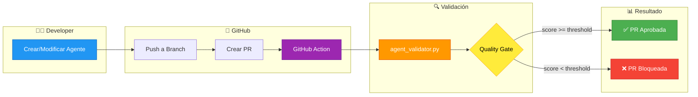
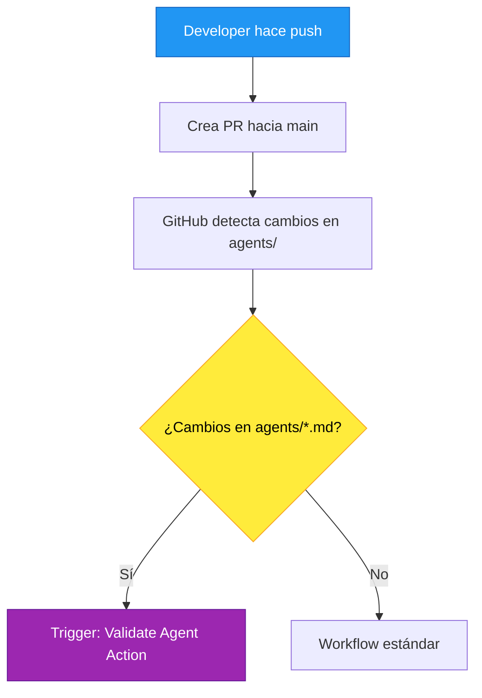
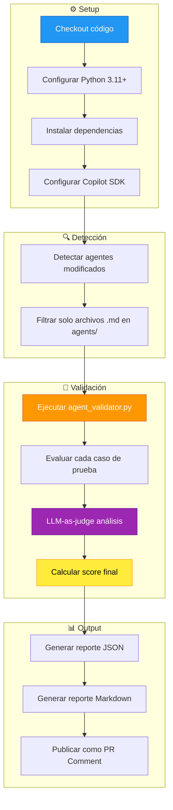
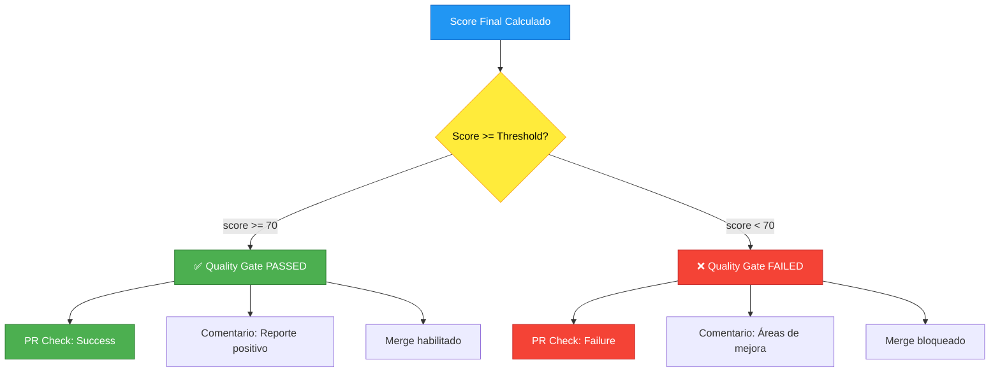
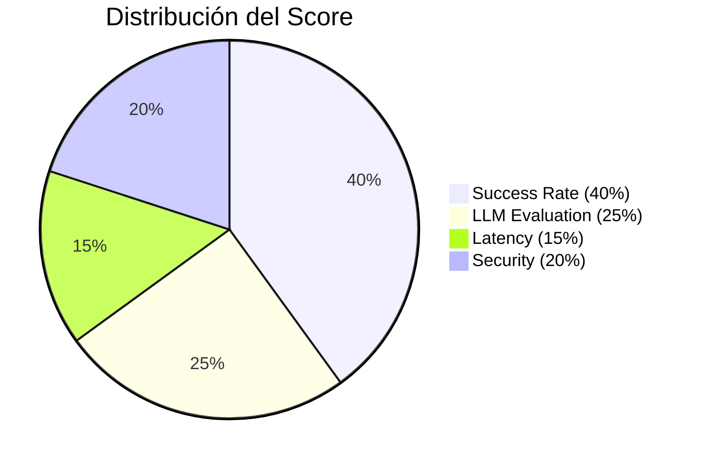
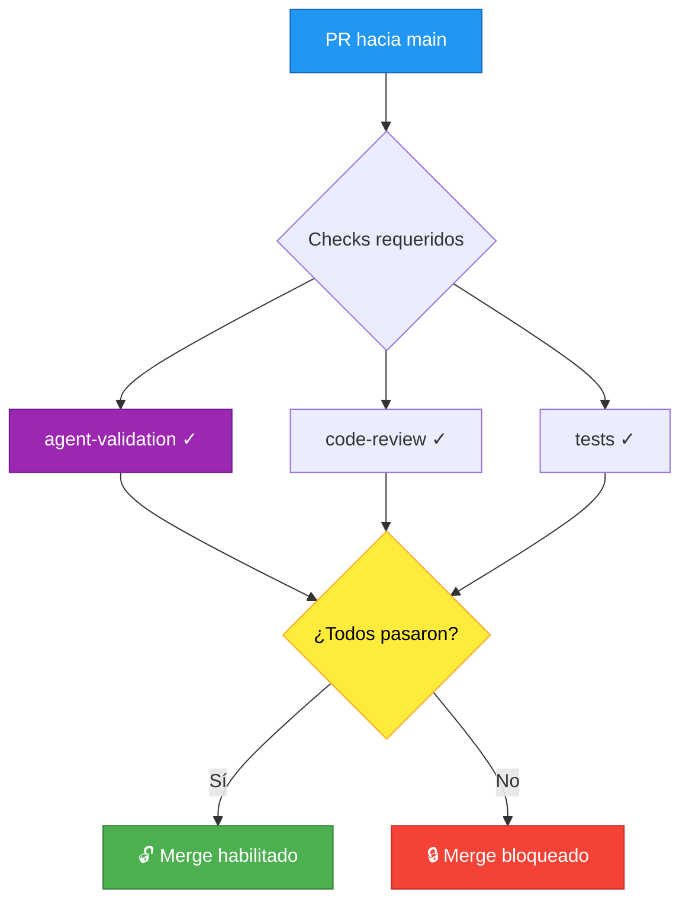
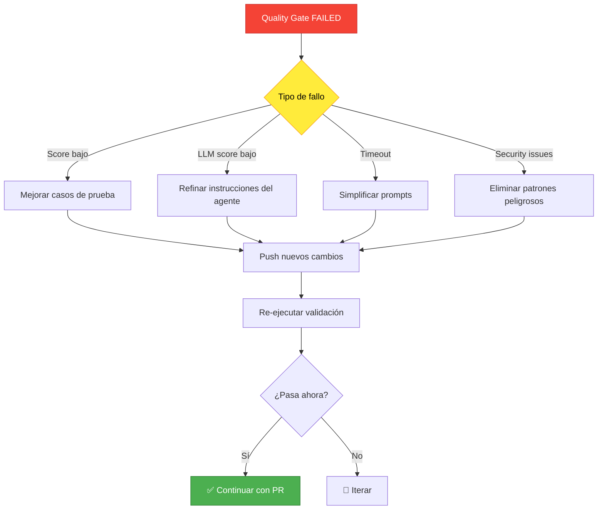

# Proceso de Validación Automática de Agentes

## Visión General



---

## Flujo del Proceso

### 1. Desarrollo del Agente

El desarrollador crea o modifica un archivo de agente en la carpeta `agents/`:

```
agents/
├── python_expert.md      ← Agente existente
├── sql_expert.md         ← Nuevo agente (PR)
└── devops_helper.md      ← Nuevo agente (PR)
```

**Requisitos del archivo de agente:**
- Nombre descriptivo (`.md`)
- Sección de instrucciones del sistema
- Mínimo 3 casos de prueba
- Campo `expected_behavior` en cada test (para LLM-as-judge)

---

### 2. Creación de Pull Request



**Triggers de la Action:**
- Push a cualquier branch con cambios en `agents/*.md`
- PR hacia `main` con cambios en `agents/*.md`
- Manual dispatch para re-validación

---

### 3. Ejecución del Validador



---

### 4. Quality Gate



**Umbrales configurables:**

| Nivel | Score Mínimo | Uso Recomendado |
|-------|--------------|-----------------|
| 🔴 Estricto | 85+ | Producción crítica |
| 🟡 Estándar | 70+ | Desarrollo normal |
| 🟢 Permisivo | 50+ | Experimentos/POC |

---

### 5. Componentes del Score

El score final se calcula con la fórmula ponderada:

```
Score = (Success × 0.40) + (LLM × 0.25) + (Latency × 0.15) + (Security × 0.20)
```



**Criterios de cada componente:**

| Componente | Qué evalúa | Cómo se mide |
|------------|------------|--------------|
| **Success Rate** | Tests pasados vs totales | `passed / total × 100` |
| **LLM Evaluation** | Calidad semántica de respuestas | Promedio de scores LLM (1-10) |
| **Latency** | Tiempo de respuesta | Penalización si > 5 segundos |
| **Security** | Ausencia de patrones peligrosos | Detección de código inseguro |

---

### 6. Reporte en PR

El validador genera un comentario automático en la PR:

```
## 🤖 Agent Validation Report

### 📊 Resumen
| Métrica | Valor |
|---------|-------|
| **Score Final** | 82.5 / 100 |
| **Quality Gate** | ✅ PASSED |
| **Tests Pasados** | 4/5 (80%) |
| **LLM Score** | 8.2/10 |

### 📋 Resultados por Test

| Test | Estado | LLM | Latencia |
|------|--------|-----|----------|
| fibonacci_basico | ✅ | 9.0 | 1.2s |
| manejo_errores | ✅ | 8.5 | 0.9s |
| optimizacion | ❌ | 6.0 | 2.1s |
| documentacion | ✅ | 8.5 | 1.5s |
| edge_cases | ✅ | 8.0 | 1.1s |

### 💡 Recomendaciones
- Test `optimizacion`: Mejorar sugerencias de complejidad algorítmica
```

---

### 7. Branch Protection Rules

Configuración recomendada para `main`:



**Configuración en GitHub:**
1. Settings → Branches → Add rule
2. Branch name pattern: `main`
3. ✅ Require status checks to pass
4. ✅ Require branches to be up to date
5. Status checks: `agent-validation`

---

## Matriz de Decisiones

### Escenarios de Validación

| Escenario | Acción | Resultado |
|-----------|--------|-----------|
| Nuevo agente, score >= 70 | Aprobar | ✅ Merge habilitado |
| Nuevo agente, score < 70 | Bloquear | ❌ Requiere mejoras |
| Modificación agente, sin regresión | Aprobar | ✅ Merge habilitado |
| Modificación agente, con regresión | Bloquear | ❌ Revisar cambios |
| Solo cambios en docs/ | Skip validación | ✅ Merge directo |
| Cambios mixtos (agents + código) | Validar agentes | Depende del score |

### Gestión de Fallos



---

## Variables de Entorno Requeridas

| Variable | Descripción | Dónde configurar |
|----------|-------------|------------------|
| `COPILOT_TOKEN` | Token de autenticación Copilot | GitHub Secrets |
| `QUALITY_THRESHOLD` | Score mínimo (default: 70) | Workflow variable |
| `ENABLE_LLM_JUDGE` | Activar evaluación LLM | Workflow variable |

---

## Siguientes Pasos

1. **Crear GitHub Action** (`agent-validation.yml`)
2. **Configurar secrets** en el repositorio
3. **Establecer branch protection** en `main`
4. **Probar con un agente de ejemplo**
5. **Documentar proceso para contribuidores**

---

## Referencias

- [AGENT_VALIDATOR_GUIDE.md](./AGENT_VALIDATOR_GUIDE.md) - Guía completa del validador
- [agent_validator.py](../agent_validator.py) - Script de validación
- [agents/python_expert.md](../agents/python_expert.md) - Ejemplo de agente válido
